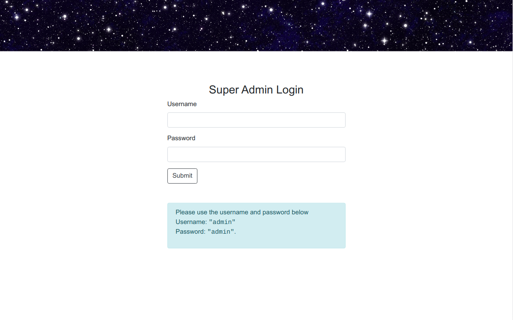
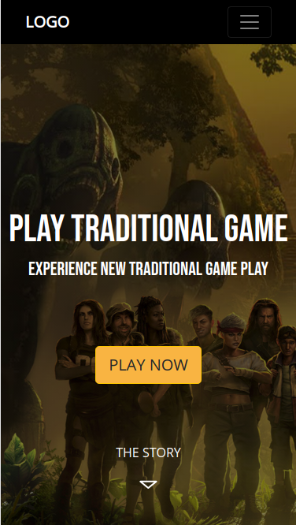
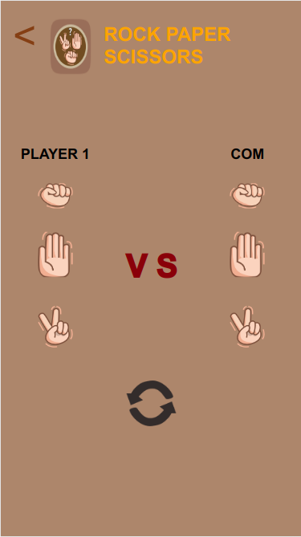

## Code Challenge Chapter 6 | CRUD Management Dashboard | Binar Academy

### Description








This is a landing page with paper rock scissors game and CRUD Dashboard using NodeJS, Express, PostgreSQL and Sequelize. This repository created to complete the Code Challenge of Chapter 6 from Binar Academy. There are 4 tables on the database after installation: `user_game`, `user_game_biodata`, `user_game_history`, `SequelizeMeta` (stores postgres setting).

Routes:

```
GET    /                              """Landing Page"""
GET    /game                          """Game"""
GET    /dashbarod                     """Admin Login"""
POST   /login                         """Simple login authentication"""
GET    /dashboard/users               """Admin Dashboard"""
GET    /dashboard/create              """Create Player Form"""
POST   /dashboard/users/create        """Create New Use"
GET    /dashboard/users/:id           """Player Detail Info"""
GET    /dashboard/users/update/:id    """Update player Form"""
PUT    /dashboard/users/update/:id    """Update User Info"""
DELETE /dashboard/users/:id           """Delete User"""
```

info 

- `db/migrations` contains sequelize migration files
- `db/models` contains sequelize models files
- `db/seeders` contains sequelize seeders files
- `config/config.json` setting for sequelize
- `utils/middleware.js` Error handlers middleware
- `.sequelizerc` sequelize initialization setting

### Instalation

**1. Clone the source code**

```
$ git clone https://github.com/ridhanf/FSW5-RFadhil-06-Challenge.git
$ cd FSW5-RFadhil-06-Challenge
```

**2. Install Dependencies**

Make sure you have [Node.js](https://nodejs.org/) and [NPM](https://www.npmjs.com/) installed. Project dependencies listed in `package.json`.

```
$ npm install
```

**3. Run sequelize**

Generate database

```
$ sequelize db:create
```

Run migration and seeders

```
$ sequelize db:migrate
$ sequelize db:seed:all
```

**4. Run the server**

Run server with:

```
$ npm run start
```

or

```
$ npm run dev
```

Server listening in port 3000 (open http://localhost:3000)

This app will automatically reload if you make changes to the code.
You will see the build errors and warnings in the console.

That's all. Thank you.

Sincerely,

&nbsp;

Ridhan Fadhilah
